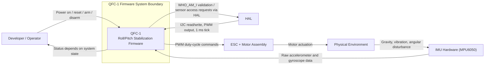

# System Context Diagram

## Purpose Of This Document

This document provides a visual companion to the system context definition for QFC-1. It shows the system boundary, the major external actors around the firmware, and the main information or control flows crossing that boundary.

It should be read together with:

- [03-system-context.md](D:/CodeX/flight-controller-firmware-system-design/documents/03-system-context.md)

## Context Diagram

### Simple Text View

```text
                   +----------------------+
                   | Developer / Operator |
                   +----------+-----------+
                              |
                 Power on / reset / arm / disarm
                              |
                              v
    +--------------+   +-----------------------------+   +--------------------+
    | IMU Hardware |-->|         QFC-1 Firmware      |-->| ESC + Motor        |
    |  (MPU6050)   |   |   Roll/Pitch Stabilization  |   | Assembly           |
    +--------------+   +-----------------------------+   +---------+----------+
           ^                         ^        |                      |
           |                         |        | PWM duty-cycle       | Motor actuation
           |                         |        v                      v
           |                 +-------+--------+            +--------------------+
           |                 |      HAL       |            | Physical           |
           |                 | I2C / PWM /    |            | Environment        |
           +-----------------| 1 ms tick      |<-----------| Disturbances       |
       Raw accelerometer     +----------------+            +--------------------+
       and gyroscope data
```



## Reading The Diagram

The diagram emphasizes four things:

1. QFC-1 is a bounded firmware system rather than the entire drone.
2. The firmware depends on external actors for sensing, timing, and actuation.
3. The HAL is a critical trust boundary between firmware logic and hardware access.
4. The environment affects the firmware indirectly through the IMU and directly through the physical response of the motors and airframe.

## Boundary Interpretation

Inside the system boundary:

- Stabilization logic
- Safety-state behavior
- Control-loop orchestration
- Sensor processing and estimation
- Command generation

Outside the system boundary:

- Sensor hardware
- ESC and motor hardware
- HAL implementation
- Physical environment
- Human/operator interaction

## What This Enables Next

The context diagram makes the next design steps easier because it visually separates:

- what the system owns
- what the system depends on
- what interactions must be represented in use cases
- what responsibilities may later be assigned to objects or modules

After this step, the next design artifact can move into use cases and grouped functional responsibilities with much less ambiguity.
