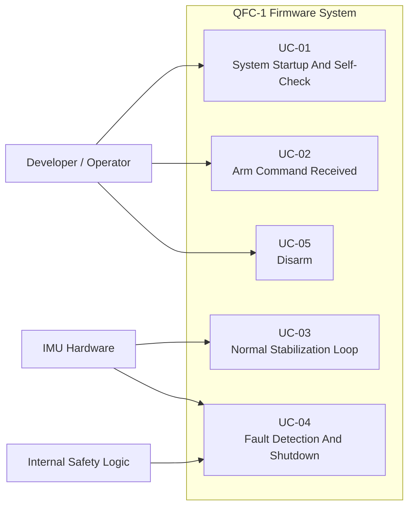

# Use Case Diagram

## Purpose Of This Document

This document provides a visual companion to the use-case analysis for QFC-1. It shows the primary external actors and the major system-level use cases identified so far.

It should be read together with:

- [04-use-cases-and-responsibilities.md](D:/CodeX/flight-controller-firmware-system-design/documents/04-use-cases-and-responsibilities.md)

## Simple Text View

```text
  +---------------------+                +------------------------+
  | Developer /         |                | IMU Hardware /         |
  | Operator            |                | Internal Safety Logic  |
  +----------+----------+                +-----------+------------+
             |                                       |
             |                                       |
             v                                       v
    +-------------------------------------------------------------+
    |                    QFC-1 Firmware System                    |
    |                                                             |
    |  [UC-01] System Startup And Self-Check                      |
    |  [UC-02] Arm Command Received                               |
    |  [UC-03] Normal Stabilization Loop                          |
    |  [UC-04] Fault Detection And Shutdown                       |
    |  [UC-05] Disarm                                             |
    +-------------------------------------------------------------+
```

## Mermaid Use Case View



## Reading The Diagram

The diagram shows that QFC-1 is driven by a small set of high-value system behaviors:

- startup and self-check
- arm
- normal stabilization
- fault handling
- disarm

It also shows that different actors influence different parts of system behavior:

- the developer/operator primarily influences lifecycle and state transitions
- the IMU is central to steady-state sensing and fault-trigger behavior
- internal safety logic participates in fault detection and shutdown behavior

## Why This Diagram Matters

At this stage, the use case diagram is useful because it keeps the focus on external behavior rather than internal structure.

It helps answer:

- what major system behaviors exist?
- which actors trigger them?
- which use cases are central to the system?

This is especially helpful before moving into candidate objects, CRC cards, and deeper structural design.

## What This Enables Next

With the use cases now documented visually as well as textually, the next structural design steps become easier:

- comparing design approaches
- mapping grouped responsibilities into candidate objects or modules
- analyzing how later CRC and object-model work should be organized
